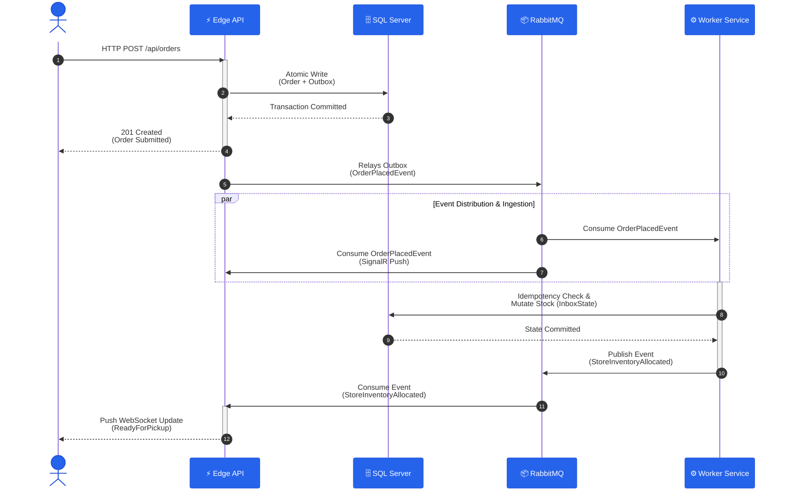

# DSG Omnichannel Engine

An enterprise-grade, comprehensive multi-component demonstration of a high-throughput "Buy Online, Pick Up In-Store" (BOPIS) order pipeline. This system processes digital orders placed on the web channel and asynchronously reconciles them against physical store-level inventory without blocking the customer's checkout request. Crucially, the implementation explicitly accounts for common failures inherent to event-driven architectures. A dedicated integration test suite (`DsgOmnichannel.IntegrationTests`) is included to actively validate these fault-tolerant design choices, ensuring resilience against issues like dual-writes, message redeliveries, and distributed transaction rollbacks.

<div align="center">



</div>

## 🏗️ Architecture & High-Level Scope

Built on a Clean Architecture foundation, the solution evaluates distributed systems resilience, transactional integrity, security context propagation, and real-time reactive UI updates. It is designed as a cohesive, multi-component tool composed of cooperating runtime modules:

*   **Edge API (`DsgOmnichannel.Api`):** Command and notification host validating inbound HTTP traffic, emitting events via a transactional outbox, and hosting the real-time SignalR hub.
*   **Orchestration Worker (`DsgOmnichannel.Worker`):** Background fulfillment host managing business rules (inventory allocation), history projections, and long-running Saga state machines.
*   **Web Dashboard (`DsgOmnichannel.Web`):** Zoneless Angular 22 presentation layer utilizing Signals for reactive, real-time order journey tracking.
*   **Shared Infrastructure:** SQL Server 2022 for persistence (domain, outbox, inbox, and saga state) and RabbitMQ for message brokering and dead-lettering.

## 🚀 Tech Stack

*   **Backend:** C# / .NET 10, ASP.NET Core Web API, Background Worker Service
*   **Data & ORM:** Entity Framework Core 10, SQL Server 2022
*   **Messaging:** MassTransit, RabbitMQ (Outbox/Inbox patterns, Saga Orchestration)
*   **Real-Time:** SignalR
*   **Frontend:** Angular 22 (Zoneless, Signals)
*   **Testing:** xUnit, `WebApplicationFactory`, Testcontainers (`DsgOmnichannel.IntegrationTests`)

## 🛡️ Event-Driven Resilience & Failure Modes Handled

Distributed event-driven systems introduce distinct failure modes that traditional monolithic applications do not face. This implementation explicitly addresses and protects against the following scenarios:

| Failure Mode | The Risk | Built-In Mitigation / Pattern |
| :--- | :--- | :--- |
| **Dual-Write / Lost Events (API Side)** | If the `Order` row commits but the broker publish fails (e.g., RabbitMQ down), the `OrderPlacedEvent` is silently lost — no allocation ever happens. | **EF Core Transactional Outbox** (`AddEntityFrameworkOutbox` + `UseBusOutbox`): `POST /api/orders` writes `Order` and `OutboxMessage` in one DB transaction. The sweeper delivers later. |
| **Dual-Write / Lost Events (Worker Side)** | Consumer sets `Order.Status = Allocated` and calls `SaveChangesAsync`, then crashes before `Publish()` reaches the broker — `StoreInventoryAllocatedEvent` is lost. | **EF Core Consumer Outbox** (`UseEntityFrameworkOutbox`): intercepts `context.Publish()` inside the consumer and stages it atomically inside the same `SaveChangesAsync` transaction. |
| **Duplicate Message Processing / Non-Idempotency** | Broker redelivers the same `OrderPlacedEvent` (e.g., after a consumer ack loss or transient fault). Without deduplication, inventory is decremented twice. | **MassTransit EF Core Inbox Pattern** (`UseEntityFrameworkOutbox` on the receive endpoint): records each `MessageId` in `InboxState`; redeliveries with the same `MessageId` are silently skipped before the consumer body executes. |
| **Distributed Rollback / Compensating Transaction** | When stock is insufficient, the consumer may set `Order.Status = AllocationFailed` but leave a stale `OrderState` row in `dbo.OrderState` — a half-committed, never-terminal saga. | **MassTransit Saga Compensating Flow** + **`SetCompletedWhenFinalized()`**: consumer publishes `AllocationFailedEvent`; saga transitions to `Faulted` and calls `Finalize()`, causing the EF Core saga repository to DELETE the `OrderState` row. |
| **Split-Transaction / Dual Authority on `Order.Status`** | Pre-fix, the saga's `ThenAsync` opened a second `DbContext` scope to write `Order.Status`, racing with the consumer's own write — two transactions owning the same field, risking overwrites or inconsistency. | **Single-Authority Separation**: consumer exclusively owns `Order.Status` (Transaction A); saga exclusively owns `OrderState` finalization (Transaction B). No cross-authority writes. |
| **Transient Dependency Failure / Retry Exhaustion** | A transient SQL Server blip causes `DbUpdateException` during `SaveChangesAsync`. Without a retry policy the message is immediately faulted and routed to DLQ — a recoverable failure becomes permanent. | **Exponential Backoff Retry** (`UseMessageRetry` with `Exponential(3, 1s, 5s, 2s)`) filtering `DbUpdateException`, `TimeoutException`, `HttpRequestException`. Faulted attempt rolls back cleanly; retry attempt re-reads and commits. |
| **Poison Message / Immediate DLQ Routing** | An unrecoverable message (e.g., unreachable DB → `SqlException`) sits in the retry loop consuming all retry slots and blocking healthy messages behind it in the same queue. | **Selective Retry Allow-list** (`r.Handle<T>()` whitelist + `r.Ignore<ArgumentException>()`): `SqlException` is not in the `Handle<>` list, so the middleware skips all retries and immediately publishes `Fault<OrderPlacedEvent>` (DLQ equivalent). |
| **Queue Starvation by Domain-Failure Messages** | A domain-failure message (e.g., stock = 0 → `AllocationFailed`) could slow processing if it blocks healthy messages that follow it in the same queue. | **Graceful Consumer Return Path**: consumer handles the `AllocationFailed` case by setting `Order.Status` and returning normally (no exception thrown). MassTransit acks and moves to the next message immediately. |
| **Never-Terminal Saga Leak (Happy Path)** | A fully completed `OrderPickedUp` flow leaves the `OrderState` row in `dbo.OrderState` indefinitely, causing unbounded table growth. | **`SetCompletedWhenFinalized()`** on the `OrderStateMachine`: when the saga reaches the `Finalized` terminal state, the EF Core saga repository issues a `DELETE` for the `OrderState` row. |
| **Never-Terminal Saga Leak (Failure Path)** | An `AllocationFailed` terminal event leaves an orphaned `OrderState` row, accumulating indefinitely even though the order is dead. | **`Finalize()` on the `AllocationFailed` transition** + **`SetCompletedWhenFinalized()`**: same deletion mechanism as the happy path, applied to the failure terminal state. |
| **Concurrent Inventory Over-Allocation (Race Condition)** | Two consumers read `StoreInventory.Quantity = 1` simultaneously, both decrement to 0, both mark their orders `Allocated` — one unit of stock fulfills two orders (negative inventory). | **EF Core Optimistic Concurrency Token (`rowversion`)** on `StoreInventory`: the second `SaveChangesAsync` fails with `DbUpdateConcurrencyException` because the `WHERE RowVersion = <original>` clause matches no row. Retry re-reads `Quantity = 0` and routes to `AllocationFailed`. |

## 🧠 Core Design Patterns

*   **Transactional Outbox & Inbox:** Ensures atomic commits between domain state and published events, avoiding dual-write issues. Global idempotent receive filters protect against duplicate message delivery.
*   **Saga Orchestration:** The `OrderStateMachine` coordinates long-running, multi-step asynchronous workflows and compensating transactions.
*   **Optimistic Concurrency Control:** System uses EF Core `rowversion` tokens to prevent race conditions during high-concurrency inventory deductions.
*   **Event-Driven Audit Logging:** Decoupled `OrderStatusHistory` projections capture append-only lifecycle events.
*   **Real-Time Reactive UI:** End-to-end web socket streams push order updates directly to Angular Signals for zero-polling UI updates.

## 🧪 Integration Testing

The `DsgOmnichannel.IntegrationTests` project contains an extensive end-to-end integration test suite. Using `Testcontainers`, the suite provisions ephemeral SQL Server and RabbitMQ instances to thoroughly validate dual-write protection, saga rollbacks, idempotency guards, and concurrency limits without relying on local machine state.

## 🛠️ Running Locally

### Prerequisites
*   .NET 10 SDK
*   Node.js v24.18.0 & npm (for Angular Web UI)
*   Docker Desktop (for local SQL Server and RabbitMQ instances)

### Steps

1.  **Start Infrastructure:**
    Ensure your local Docker environment is running, then spin up the backing services using Docker Compose:
    ```bash
    docker-compose up -d
    ```
2.  **Run the API:**
    Navigate to `src/DsgOmnichannel.Api` and run the project (starts on `https://localhost:7156`). The Swagger UI will be available for submitting mock orders.
3.  **Run the Worker:**
    Navigate to `src/DsgOmnichannel.Worker` and start the host to process the queue.
4.  **Run the Web UI:**
    Navigate to the `DsgOmnichannel.Web` directory and start the Angular development server.